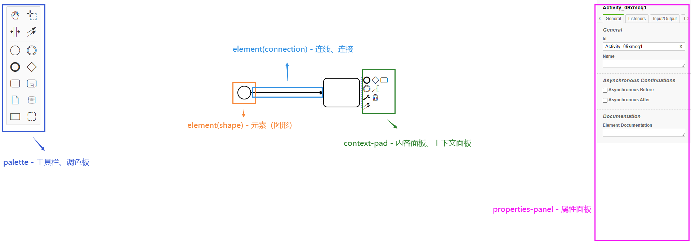
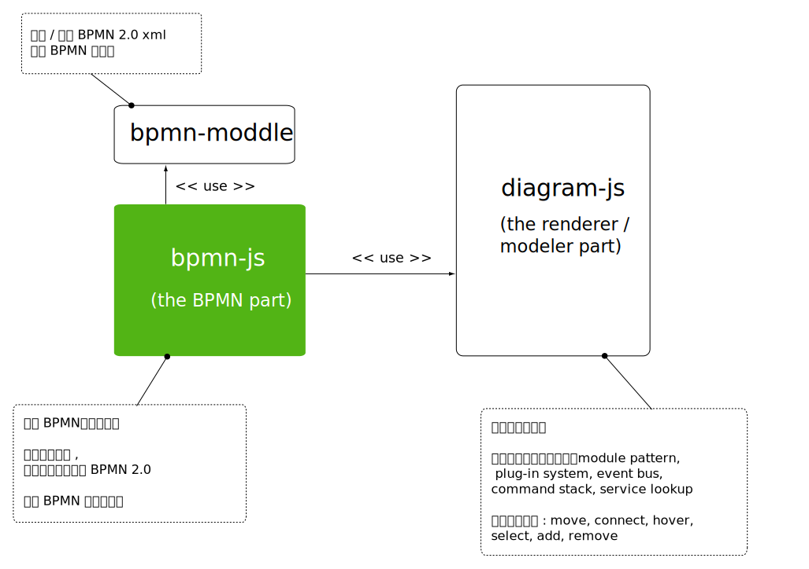
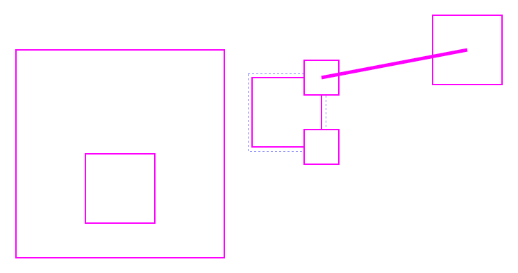

# 介绍

[bpmn-js](https://github.com/bpmn-io/bpmn-js) 是 BPMN 2.0 呈现工具包和 Web 建模器。它是用 JavaScript 编写的，将 BPMN 2.0 图表嵌入到现代浏览器中，并且不需要服务器后端。这样可以轻松将其嵌入到任何 Web 应用程序中。

该库以既可以查看器又可以是 Web 建模器的方式构建。使用 [viewer](https://github.com/bpmn-io/bpmn-js-examples/tree/master/url-viewer) 将 BPMN 2.0 嵌入到您的应用程序中，[并用您的数据丰富它](https://github.com/bpmn-io/bpmn-js-examples/tree/master/overlays)。使用 [modeler](https://github.com/bpmn-io/bpmn-js-examples/tree/master/modeler) 在应用程序内部创建 BPMN 2.0 图表。

了解内部之前先了解下外观：



下面介绍库内部的一些见解，即有助于其高度模块化和可扩展结构的组件。

## 了解 bpmn-js 内部

如下图所示，bpmn-js 建立在两个重要的库之上：diagram-js 和 bpmn-moddle。

bpmn-js 体系结构


我们使用 [diagram-js](https://github.com/bpmn-io/diagram-js) 绘制图形和连线。它为我们提供了与这些图形元素进行交互的方法，以及诸如叠加层之类的其他工具，可以帮助用户构建功能强大的 BPMN 查看器。对于诸如建模之类的高级用例，它贡献了上下文垫，调色板和重做/撤消之类的功能。

[bpmn-moddle](https://github.com/bpmn-io/bpmn-moddle) 知道 [BPMN 2.0](https://www.omg.org/spec/BPMN/2.0/) 标准中定义的 BPMN 2.0 元模型。它使我们能够读写 BPMN 2.0 架构兼容的 XML 文档，并访问在图上绘制的图形和连线背后的 BPMN 相关信息。

在这两个库的基础上，[bpmn-js](https://github.com/bpmn-io/bpmn-js) 定义了 BPMN 细节，例如外观，建模规则和工具（即调色板）。在以下段落中，我们将详细介绍各个组件。

### 图交互/建模（diagram-js）

在后台，[diagram-js](https://github.com/bpmn-io/diagram-js) 使用依赖注入（DI）来连接和发现图组件。该机制建立在 [didi](https://github.com/nikku/didi) 之上。

在 `diagram-js` 的上下文中讨论模块时，我们指的是提供命名服务及其实现的单元。从这个意义上说，服务是一个函数或实例，它可以使用其他服务来完成关系图上下文中的工作。

> 🙋‍♂️ 是的，大部分的自定义都是基于此来完成的，理解很重要！

下面显示了一个与生命周期事件挂钩的服务。它通过另一个标准服务工具 eventBus 注册一个事件：

```js
function MyLoggingPlugin(eventBus) {
	eventBus.on('element.changed', function(event) {
		console.log('element ', event.element, ' changed')
	})
}

// ensure the dependency names are still available after minification
MyLoggingPlugin.$inject = ['eventBus']
```

我们必须使用模块定义以唯一名称发布服务

```js
import CoreModule from 'diagram-js/lib/core'

// export as module
export default {
	__depends__: [CoreModule], // {2}
	__init__: ['myLoggingPlugin'], // {3}
	myLoggingPlugin: ['type', MyLoggingPlugin] // {1}
}
```

该定义告诉 DI 基础设施，该服务称为 `myloggingpluging{1}`，它依赖于 `diagram-js` 核心模块{2}，并且服务应该在创建图{3}时初始化。有关更多详细信息，请参阅 [didi](https://github.com/nikku/didi/blob/master/README.md) 文档

我们现在可以引导 diagram-js，传递我们的自定义模块：

```js
import MyLoggingModule from 'path-to-my-logging-module'

var diagram = new Diagram({
	modules: [MyLoggingModule]
})
```

插入模块到 bpmn-js，您可以使用 additionalModules 选项，如[扩展建模者部分](https://bpmn.io/toolkit/bpmn-js/walkthrough/#extend-the-modeler)。

#### 核心服务

[diagram-js 核心](https://github.com/bpmn-io/diagram-js/tree/master/lib/core)是围绕许多基本服务构建的：

- [`Canvas`](https://github.com/bpmn-io/diagram-js/blob/master/lib/core/Canvas.js) - 提供了 api 用于添加和删除图形元素；处理生命周期的元素，并提供 api 来缩放和滚动。

- [`EventBus`](https://github.com/bpmn-io/diagram-js/blob/master/lib/core/EventBus.js) -
  这个库使用 fire 和 forget 策略的全局通信。相关模块可以订阅的各种事件，并在它们触发后立即采取行动。事件总线可以帮助我们解耦问题，并且模块化功能。
- [`ElementFactory`](https://github.com/bpmn-io/diagram-js/blob/master/lib/core/ElementFactory.js) - 用于根据 diagram-js 的内部数据模型创建图形和连线的工厂。

- [`ElementRegistry`](https://github.com/bpmn-io/diagram-js/blob/master/lib/core/ElementRegistry.js) - 知道添加到图表中的所有元素，并提供 API 来检索元素及其图形化表示（通过 id）。

- [`GraphicsFactory`](https://github.com/bpmn-io/diagram-js/blob/master/lib/core/GraphicsFactory.js) - 负责创建图形和连线的图形表示。实际的外观由渲染器定义，即 [draw module](https://github.com/bpmn-io/diagram-js/tree/master/lib/draw) 模块内的 [DefaultRenderer](https://github.com/bpmn-io/diagram-js/blob/master/lib/draw/DefaultRenderer.js)

#### 数据模型

在内部，diagramjs 实现了一个由图形和连线组成的简单数据模型。



一个图形有父对象、子对象集合以及传入和传出连线的集合。

一个连线有一个父对象以及一个源头和目的地，指向一个图形。

[ElementRegistry](https://github.com/bpmn-io/diagram-js/blob/master/lib/core/ElementRegistry.js) 负责根据该模型创建图形和连线。在建模过程中，[Modeling 服务](https://github.com/bpmn-io/diagram-js/blob/master/lib/features/modeling/Modeling.js)将根据用户操作更新元素关系。

#### 辅助服务（即工具箱）

除了数据模型及其核心服务之外，diagram-js 还提供了一个丰富的工具箱，其中包含其他帮助程序。

Aside from the data model and its core services, diagram-js provides a rich toolbox of additional helpers.

- [`CommandStack`](https://github.com/bpmn-io/diagram-js/blob/master/lib/command/CommandStack.js) - 负责建模过程中的重做和撤消。
- [`ContextPad`](https://github.com/bpmn-io/diagram-js/blob/master/lib/features/context-pad/ContextPad.js) - 围绕提供元素的上下文操作。
- [`Overlays`](https://github.com/bpmn-io/diagram-js/blob/master/lib/features/overlays/Overlays.js) - 提供了用于图表元素的附加信息 api 。
- [`Modeling`](https://github.com/bpmn-io/diagram-js/blob/master/lib/features/modeling/Modeling.js) - 提供用于更新画布上元素的 API（移动、删除）🙋‍♂️ 这个常用
- [`Palette`](https://github.com/bpmn-io/diagram-js/blob/master/lib/features/palette/Palette.js) - 左侧工具栏
- ...

#### BPMN 元模型（bpmn-moddle）

[bpmn-moddle](https://github.com/bpmn-io/bpmn-moddle) 封装了 BPMN 2.0 元模型，并为我们提供了读写 BPMN 2.0 XML 文档的便利。导入时，它将 XML 文档解析为 JavaScript 对象树。该树在建模期间进行了编辑和验证，然后一旦用户希望保存该图，就将其导出回 BPMN 2.0 XML。因为 bpmn-moddle 封装了有关 BPMN 的知识，所以我们能够在导 ​​ 入和建模期间进行验证。根据结果 ​​，我们可以约束某些建模操作，并向用户输出有用的错误消息和警告。

就像 bpmn-js 一样，bpmn-moddle 的基础建立在两个库的基础上：

- [moddle](https://github.com/bpmn-io/moddle) 提供了一种简洁的方法来定义 JavaScript 中的[元模型](https://en.wikipedia.org/wiki/Metamodeling)
- [moddle-xml](https://github.com/bpmn-io/moddle-xml) 基于 [moddle](https://github.com/bpmn-io/moddle) 读写 XML 文档

实质上，[bpmn-moddle](https://github.com/bpmn-io/bpmn-moddle) 将 BPMN 规范添加为元模型，并提供了用于 BPMN 模式验证的简单接口。从库的角度来看，它提供了以下 API：

[fromXML](https://github.com/bpmn-io/bpmn-moddle/blob/master/lib/bpmn-moddle.js#L38) -从给定的 XML 字符串创建 BPMN 树
[toXML](https://github.com/bpmn-io/bpmn-moddle/blob/master/lib/bpmn-moddle.js#L65) -将 BPMN 对象树写入 BPMN 2.0 XML

BPMN 元模型对于 BPMN-js 至关重要，因为它允许我们验证所使用的 bpmn2.0 文档，提供适当的建模规则，并导出所有符合 BPMN 建模者都能理解的有效 BPMN 文档。

### 将事物整合在一起（bpmn-js）

我们了解到 [bpmn-js](https://github.com/bpmn-io/bpmn-js) 构建在 [diagram-js](https://github.com/bpmn-io/diagram-js) 和 [bpmn-moddle](https://github.com/bpmn-io/bpmn-moddle) 之上。它把两者联系在一起，并增加了 BPMN 的外观。这包括 BPMN 调色板，BPMN 上下文板以及 BPMN 2.0 特定规则。在本节中，我们将解释它在建模的不同阶段如何工作。

当我们导入 BPMN 2.0 文档时，它会通过 [bpmn-moddle](https://github.com/bpmn-io/bpmn-moddle) 从 XML 解析到对象树中。bpmn-js 渲染该树的所有可见元素，即，它在画布上创建各自的形状和连接。因此，它将 BPMN 元素和图形元素联系在一起。如下所示，这将生成一个开始事件形状的结构。

```js
{
  id: 'StartEvent_1',
  x: 100,
  y: 100,
  width: 50,
  height: 50,
  businessObject: {
    $attrs: Object
    $parent: {
      $attrs: Object
      $parent: ModdleElement
      $type: 'bpmn:Process'
      flowElements: Array[1]
      id: 'Process_1'
      isExecutable: false
    }
    $type: 'bpmn:StartEvent'
    id: 'StartEvent_1'
  }
}
}
```

您可以通过 `businessObject` 属性从每个图形元素访问基础 BPMN 类型。

[bpmn-js](https://github.com/bpmn-io/bpmn-js) 还通过知道了每个 BPMN 元素的外观 [BpmnRenderer](https://github.com/bpmn-io/bpmn-js/blob/master/lib/draw/BpmnRenderer.js)。通过插入渲染周期，您还可以定义各个 BPMN 元素的自定义表示。

导入完成后，我们就可以开始建模了。我们使用规则来允许或禁止某些建模操作。这些规则由定义 [BpmnRules](https://github.com/bpmn-io/bpmn-js/blob/master/lib/features/rules/BpmnRules.js)。我们将这些规则基于 [OMG](https://www.omg.org/) 定义的 BPMN 2.0 标准。但是，如前所述，其他人也可能会参与规则评估以贡献不同的行为。

[modeling module](https://github.com/bpmn-io/bpmn-js/tree/master/lib/features/modeling)捆绑了 bpmn2.0 相关的建模功能。它添加了特定于 bpmn2.0 的建模行为，并负责使用用户执行的每个建模操作更新 bpmn2.0 文档树（参见 [BpmnUpdater](https://github.com/bpmn-io/bpmn-js/blob/master/lib/features/modeling/BpmnUpdater.js)）。查看它可以更深入地了解规则、行为和 BPMN 更新周期。

当纯粹从库的角度来看 bpmn js 时，值得一提的是它可以用在三个变体中：

- [Viewer](https://github.com/bpmn-io/bpmn-js/blob/master/lib/Viewer.js) BPMN 图表查看器
- [NavigatedViewer](https://github.com/bpmn-io/bpmn-js/blob/master/lib/NavigatedViewer.js) 包含鼠标导航工具的图表查看器
- [Modeler](https://github.com/bpmn-io/bpmn-js/blob/master/lib/Modeler.js) BPMN 图表建模器

[NavigatedViewer](https://github.com/bpmn-io/bpmn-js/blob/master/lib/NavigatedViewer.js) 添加了用于导航画布的模块，[Modeler](https://github.com/bpmn-io/bpmn-js/blob/master/lib/Modeler.js) 添加了大量用于创建、编辑画布上的元素并与之交互的功能。

## 最后

以上介绍了 `bpmn-js` 的两个基础 `diagram-js` 以及 `bpmn-moddle`，并概述了 bpmn-js 如何将所有这些都塞在一起。

有许多其他资源可以使您进一步发展：

- [示例](https://github.com/bpmn-io/bpmn-js-examples)-大量示例展示了如何嵌入和扩展 bpmn-js。
- 源代码（[bpmn-js](https://github.com/bpmn-io/bpmn-js)，[diagram-js](https://github.com/bpmn-io/diagram-js)）-大多有据可查；应该给您关于这个库内部的深刻见解。
- [论坛](https://forum.bpmn.io/c/developers)-获得使用和扩展 bpmn-js 的帮助的好地方。

---

# 总结

以上内容来自 [https://bpmn.io/toolkit/bpmn-js/walkthrough/](https://bpmn.io/toolkit/bpmn-js/walkthrough/)，有做修改，欢迎指正。

主要关注

- [bpmn-js](https://github.com/bpmn-io/bpmn-js)
- [diagram-js](https://github.com/bpmn-io/diagram-js)

大部分都是通过修改他俩的代码来实现自定义一些功能
我们要的功能基本都在 `lib/features/` 或者 `lib/core/` 以及 `lib/draw/` 中
虽然寻找和阅读 BPMN 的文档艰难了点，但是他们的扩展做得还是很棒的，代码写得也很通俗易懂。
